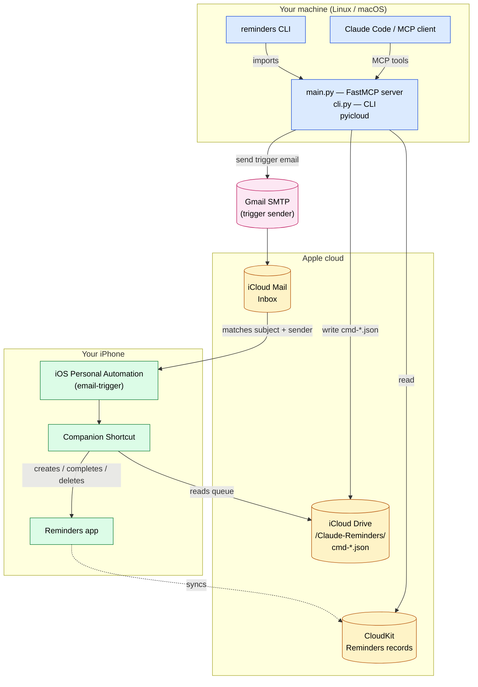
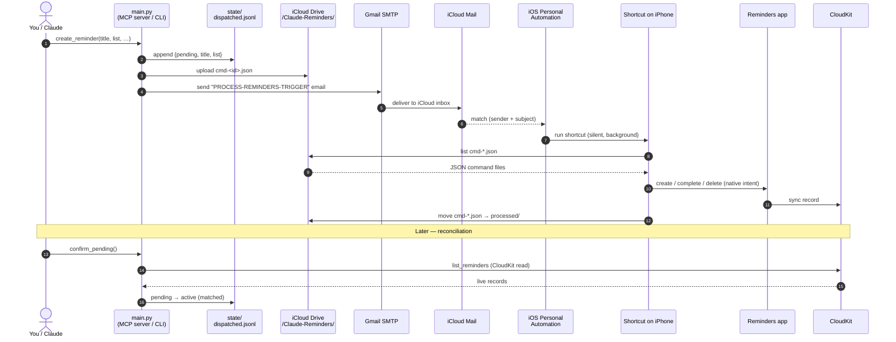

# apple-reminders-mcp-cli

> **MCP server + CLI for Apple Reminders, runnable from any Linux/macOS machine — no Mac in the loop.**
>
> Reads via CloudKit (Apple's public read API). Writes via an iCloud Drive
> bridge — JSON command files dropped on iCloud Drive, picked up by a
> companion iPhone Shortcut, which creates the real reminders on-device.

Designed for use with [Claude Code](https://docs.claude.com/en/docs/claude-code) or any other MCP client, and equally usable as a plain CLI.

---

## Why this exists

Apple's official APIs only offer **read** access to Reminders via CloudKit. There's no public write API. This project works around that by:

- **Reading** reminders directly from CloudKit using [`pyicloud`](https://github.com/picklepete/pyicloud)
- **Writing** by dropping JSON command files into a folder on iCloud Drive that an iPhone Shortcut picks up and turns into real reminders

Result: a headless Linux server (or any Linux/macOS box) can fully manage your iPhone Reminders without needing a Mac mini, AppleScript, or any local Apple toolchain.

---

## Architecture



The write path is gated by a **silent email trigger**: the Linux side sends an email with a known subject from a Gmail account to your iCloud address, and an iOS 17+ **Personal Automation** matches it and runs the Shortcut headlessly with the phone locked. End-to-end latency: ~30–60 seconds.

If you skip the email-trigger setup, the Shortcut can still be run by a timer-based Personal Automation (every N minutes) or by tapping it manually — uploads will queue and process eventually.

---

## What's in this repo

| File | What it is |
|---|---|
| `main.py` | FastMCP server exposing 7 tools: `list_reminders`, `list_reminder_lists`, `create_reminder`, `create_multiple_reminders`, `complete_reminder`, `delete_reminder`, `list_pending_commands`. |
| `cli.py` | CLI mirroring the MCP, JSON output by default, `--pretty` for human-readable. |
| `setup_auth.py` | One-time interactive iCloud HSA2 (2FA) auth. Stores session at `~/.config/apple-reminders/`. Idempotent on re-run. |
| `manifest.json` | DXT-format MCP descriptor (for distribution / Claude Desktop import). |
| `Process-Claude-Reminders.shortcut` | Pre-built signed companion Shortcut binary — AirDrop or share to your iPhone and tap to add. |
| `config.example.json` | Template for the runtime config. Copy to `~/.config/apple-reminders/config.json` and fill in your own creds. |
| `SECURITY.md` | Threat model, secret handling, dependency notes. |
| `pyproject.toml`, `uv.lock` | uv-managed dependencies (`mcp[cli]>=1.6.0`, `pyicloud>=2.4.0`). |

---

## Setup

### Prerequisites

- Linux or macOS (tested on Linux)
- [uv](https://docs.astral.sh/uv/) installed
- An iPhone with iOS 17+ and the Reminders app
- An Apple ID with HSA2 (two-factor) enabled
- An **app-specific password** — generate one at <https://appleid.apple.com/account/manage> → Security → App-Specific Passwords. (This is NOT your Apple ID password.)
- *(Optional but recommended)* A Gmail account + Gmail App Password for the silent email-trigger path

### 1. Clone & install

```bash
git clone https://github.com/jkan67-de/apple-reminders-mcp-cli ~/apple-reminders-mcp-cli
cd ~/apple-reminders-mcp-cli
uv sync
```

### 2. Configure credentials

```bash
mkdir -p ~/.config/apple-reminders
cp config.example.json ~/.config/apple-reminders/config.json
chmod 600 ~/.config/apple-reminders/config.json
$EDITOR ~/.config/apple-reminders/config.json
```

At minimum, fill in `apple_id` and `app_password`. The email-trigger fields are only needed if you want silent background delivery; you can leave them blank and start with manual Shortcut runs.

### 3. Authenticate to iCloud

```bash
uv run python setup_auth.py
```

On first run this prompts for the Apple ID + app-specific password and runs the 2FA flow (SMS or push to a trusted device). The session pickle is stored at `~/.config/apple-reminders/session/`.

Re-running is **idempotent**: it first checks whether the existing session is still valid and exits cleanly if so. Useful flags:

| Flag | What it does |
|---|---|
| (no flag) | Skip if session is valid, full re-auth if not |
| `--check` | Just report validity (exit 0/1), no prompts |
| `--force` | Skip the validity check, do full re-auth |

### 4. Install the companion iPhone Shortcut

AirDrop (or otherwise transfer) `Process-Claude-Reminders.shortcut` from this repo to your iPhone and tap it to add. The Shortcut watches `iCloud Drive/Claude-Reminders/`, parses each `cmd-*.json` it finds, and creates / completes / deletes the corresponding reminder.

### 5. (Recommended) Wire up the silent email trigger

This uses an iOS Personal Automation that runs the Shortcut whenever a matching email arrives — silently, in the background, even with the phone locked.

1. Configure `smtp_user`, `smtp_app_password`, `trigger_email_to`, `trigger_email_subject` in `~/.config/apple-reminders/config.json`. Use a Gmail account with a [Gmail App Password](https://myaccount.google.com/apppasswords).
2. On iPhone: Shortcuts → Automation → New → **Email** trigger:
   - Account: iCloud (the one matching `trigger_email_to`)
   - From: the Gmail address you put in `smtp_user`
   - Subject contains: `PROCESS-REMINDERS-TRIGGER` (or whatever you set as `trigger_email_subject`)
   - Run Immediately: **ON**
   - Notify When Run: **OFF**
   - Ask Before Running: **OFF**
   - Action: **Run Shortcut → Process-Claude-Reminders**
3. (Optional) Set up `icloud_imap_user` + `icloud_imap_app_password` and a daily cron / systemd timer running `reminders cleanup` to delete trigger emails from the iCloud Inbox.

End-to-end latency: ~30–60 seconds. Works with the phone locked.

**No trigger?** You can skip step 5 entirely and just rely on a timer-based Personal Automation (every N minutes) or manual taps on the Shortcut. Writes queue to iCloud Drive and process whenever the Shortcut runs next.

### 6. Register the MCP with Claude Code

```bash
claude mcp add --scope user apple-reminders \
  $(which uv) -- run --directory $HOME/apple-reminders-mcp-cli python main.py
```

Verify:

```bash
claude mcp list | grep apple-reminders     # should show "✓ Connected"
```

### 7. (Optional) Install the CLI shim

```bash
mkdir -p ~/.local/bin
cat > ~/.local/bin/reminders <<EOF
#!/bin/bash
exec $(which uv) run --directory \$HOME/apple-reminders-mcp-cli python cli.py "\$@"
EOF
chmod +x ~/.local/bin/reminders
```

Verify:

```bash
reminders lists
reminders list --pretty
```

---

## Usage

### CLI

```bash
# Reads
reminders lists                                 # all reminder lists
reminders list                                  # all incomplete reminders
reminders list --show-completed                 # include completed
reminders list --pretty                         # human-readable

# Single create
reminders create "Buy milk" --list "Shopping List"
reminders create "Call mum" --priority High --flag --notes "Birthday Sunday"
reminders create "Read paper" --url "https://arxiv.org/abs/..."

# Batch create (one trigger fire for the whole batch)
echo '[
  {"title": "Buy milk", "list": "Shopping List", "priority": "High"},
  {"title": "Call dentist", "notes": "Ask about insurance", "flagged": "true"}
]' | reminders create-multi
# or:
reminders create-multi --file batch.json

# Mutations
reminders complete "Buy milk"                   # mark done by title (partial match)
reminders delete "Old task"                     # delete by title (partial match)

# Diagnostics + manual control
reminders pending --pretty                      # iCloud Drive files awaiting Shortcut
reminders fire --reason "manual retry"          # re-send the trigger email
reminders cleanup                               # delete accumulated trigger emails (iCloud IMAP)
```

### MCP (from Claude Code)

After registration, the 7 tools appear automatically as `mcp__apple-reminders__*`. Use them like any other MCP tool — `mcp__apple-reminders__create_reminder`, etc.

---

## How writes work, in detail



**Step-by-step:**

1. You (or Claude) call `create_reminder(...)`.
2. `main.py` appends a `pending` row to `state/dispatched.jsonl` (the dispatch ledger).
3. `main.py` writes a JSON command file (`cmd-<8hex>.json`) to `iCloud Drive/Claude-Reminders/` via `pyicloud`'s Drive API.
4. `main.py` fires the trigger email via Gmail SMTP.
5. The iPhone's Personal Automation matches the email by sender + subject and runs the Shortcut silently.
6. The Shortcut iterates the folder, parses each `cmd-*.json`, and uses native iOS Reminders intents to create / complete / delete the reminder.
7. Processed files are moved to a `processed/` subfolder.
8. Next time you `reminders list`, the new reminder is visible via CloudKit read.

The **dispatch ledger** prevents duplicate creates if you fire the same reminder twice, and lets `confirm_pending` reconcile sent-vs-landed state against the live phone (transitioning `pending → active`, `delete-pending → deleted`, `complete-pending → completed`).

---

## Troubleshooting

| Symptom | Likely cause | Fix |
|---|---|---|
| `claude mcp list` shows ✗ Disconnected | Session expired, or `uv` missing on PATH | `uv run python setup_auth.py`; check `which uv` |
| Reads work, writes silently fail | iPhone Shortcut not installed / not running | Install the Shortcut; verify it can run when triggered manually |
| Writes queue but never process | Email-trigger automation not set up, or Gmail App Password rejected | Check Mail.app inbox on iPhone for the trigger email; check stderr |
| `2FA required` on every run | Session pickle / cookies expired | Re-run `setup_auth.py --force` |
| `pyicloud` import error | Deps not installed | `uv sync` |
| Cookies error in pyicloud | Empty-domain duplicate cookies (known pyicloud quirk) | Already handled by `_dedupe_cookiejar`; re-run `setup_auth.py` |

---

## Security

See [`SECURITY.md`](./SECURITY.md) for the threat model, where secrets live, and how to report a security issue.

The short version: all credentials live in `~/.config/apple-reminders/config.json` (chmod 600, not in the repo). App-specific passwords are revocable individually at <https://appleid.apple.com> — rotate them if a machine running this is ever compromised.

---

## License

MIT — see [LICENSE](./LICENSE).

---

## Acknowledgements

- [`pyicloud`](https://github.com/picklepete/pyicloud) for CloudKit + iCloud Drive access
- [`mcp` / FastMCP](https://github.com/modelcontextprotocol) for the MCP server scaffolding
