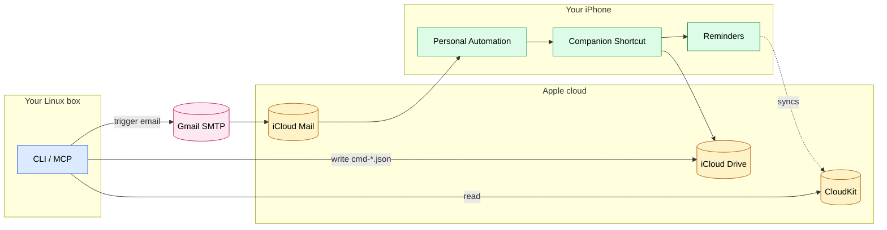

# apple-reminders-mcp-cli

> Push to Apple Reminders from a Linux terminal. No Mac. No AppleScript. Just iPhone.

## Why this exists

I live on Linux but my reminders live on my iPhone. Apple gives you read access to Reminders via CloudKit, but no public write API. So I built this:

- a **CLI** I actually use day-to-day to drop reminders into my iPhone from the shell
- an **MCP server** wrapping the same operations so Claude Code (or any MCP client) can do it too

The CLI is the primary thing. The MCP is the bonus.

## How it works



- **Reads** go directly to CloudKit (Apple's public read API) via [`pyicloud`](https://github.com/picklepete/pyicloud).
- **Writes** drop a JSON command file into `iCloud Drive/Claude-Reminders/`, then send a "trigger email" to your iCloud address. An iOS Personal Automation matches it by subject and silently runs the companion Shortcut, which reads the JSON and creates the reminder natively.

## Repo layout

```
apple_reminders/        # package — sources
  main.py               # FastMCP server + all logic
  cli.py                # CLI wrapper
  setup_auth.py         # one-time iCloud HSA2 auth
assets/
  Process-Claude-Reminders.shortcut   # companion Shortcut binary
config.example.json     # credential template
manifest.json           # DXT MCP descriptor
SECURITY.md
```

## Setup

```bash
git clone https://github.com/jkan67-de/apple-reminders-mcp-cli ~/apple-reminders-mcp-cli
cd ~/apple-reminders-mcp-cli

# Pick one:
uv sync                                # if you use uv (recommended — pins everything from uv.lock)
# OR
python3 -m venv .venv && . .venv/bin/activate && pip install -r requirements.txt

# 1. Config — fill in your Apple ID + app-specific password (and Gmail creds if you want the silent trigger)
mkdir -p ~/.config/apple-reminders
cp config.example.json ~/.config/apple-reminders/config.json
chmod 600 ~/.config/apple-reminders/config.json
$EDITOR ~/.config/apple-reminders/config.json

# 2. Auth (one-time; idempotent on re-run)
uv run python -m apple_reminders.setup_auth

# 3. Install the Shortcut on your iPhone: AirDrop assets/Process-Claude-Reminders.shortcut and tap to add.

# 4. (Recommended) Wire up the silent email trigger:
#    On iPhone → Shortcuts → Automation → New → Email trigger
#    - From: <your Gmail address>
#    - Subject contains: PROCESS-REMINDERS-TRIGGER
#    - Run Immediately ON, Notify OFF, Ask Before Running OFF
#    - Action: Run Shortcut → Process-Claude-Reminders
```

App-specific password: <https://appleid.apple.com/account/manage> → Security → App-Specific Passwords. (Not your Apple ID password.)
Gmail app password: <https://myaccount.google.com/apppasswords>.

Without the email-trigger automation, writes still queue to iCloud Drive — they just process whenever you next run the Shortcut manually.

## Use it — CLI

This is what I actually use. The `reminders` command is installed by `uv sync` via `pyproject.toml` console scripts:

```bash
uv run reminders lists                          # all reminder lists
uv run reminders list                           # all incomplete reminders
uv run reminders list --pretty                  # human-readable

uv run reminders create "Buy milk" --list "Shopping List"
uv run reminders create "Call mum" --priority High --flag

uv run reminders complete "Buy milk"
uv run reminders delete "Old task"

uv run reminders fire --reason "manual retry"   # re-send the trigger email
uv run reminders cleanup                        # delete accumulated trigger emails
```

Batch creates accept a JSON list on stdin or via `--file`, and fire the trigger email once for the whole batch:

```bash
echo '[{"title":"Milk","list":"Shopping"},{"title":"Bread","list":"Shopping"}]' | uv run reminders create-multi
```

For the shorter `reminders` invocation, drop a shim on your PATH:

```bash
mkdir -p ~/.local/bin
cat > ~/.local/bin/reminders <<'EOF'
#!/bin/bash
exec uv run --directory "$HOME/apple-reminders-mcp-cli" reminders "$@"
EOF
chmod +x ~/.local/bin/reminders
```

## Use it — MCP (Claude Code)

Register the server once:

```bash
claude mcp add --scope user apple-reminders \
  $(which uv) -- run --directory $HOME/apple-reminders-mcp-cli apple-reminders-mcp
```

After that, Claude Code gets 7 tools: `mcp__apple-reminders__create_reminder`, `…__list_reminders`, `…__complete_reminder`, `…__delete_reminder`, `…__create_multiple_reminders`, `…__list_reminder_lists`, `…__list_pending_commands`.

## Troubleshooting

| Symptom | Fix |
|---|---|
| `mcp list` shows ✗ Disconnected | Re-run `uv run python -m apple_reminders.setup_auth` |
| Writes queue but never process | Check the iOS Personal Automation is set up and the trigger email is arriving |
| `2FA required` on every run | `uv run python -m apple_reminders.setup_auth --force` |
| Cookie/MFA weirdness from pyicloud | Re-run `setup_auth` — the dedupe helper fixes the common quirk |

## Security

See [SECURITY.md](./SECURITY.md). The short version: all creds live in `~/.config/apple-reminders/config.json` (chmod 600, not in the repo); app-specific passwords are individually revocable at <https://appleid.apple.com>.

## License

MIT — see [LICENSE](./LICENSE).
